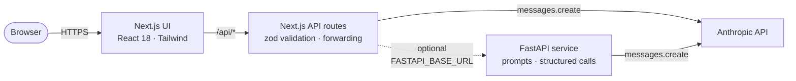

<div align="center">

# PersonaFlow AI

### *Communication, attuned.*

Adaptive AI that reads **tone**, **emotion**, and **intent** — then rewrites your words to land exactly how you mean them.

**English · اردو · العربية**


[**Live demo →**](#) · [Pitch deck](docs/pitch-deck.md) · [Architecture](#architecture) · [Run locally](#run-locally)

[](https://vercel.com/new/clone?repository-url=https%3A%2F%2Fgithub.com%2Fmabdulbais%2FPersonaFlow-AI&env=ANTHROPIC_API_KEY&envDescription=Anthropic%20API%20key%20%E2%80%94%20server-only&envLink=https%3A%2F%2Fconsole.anthropic.com&project-name=personaflow-ai&repository-name=PersonaFlow-AI&root-directory=frontend)

<sub>Live-demo URL above is a placeholder until you deploy. The Vercel button deploys the `frontend/` directory with `ANTHROPIC_API_KEY` pre-wired as an env var. See [Run locally](#run-locally) for the full stack including FastAPI.</sub>

<!-- Replace with docs/screenshots/hero.png once captured -->
<!--  -->

</div>

---

## What it does

Four working modules — each one a real AI-driven workflow:

| | Module | What it does |
|---|---|---|
| **01** | **Message Studio**       | Paste any message. Get a 0–100 communication score, current tone, emotional intensities, four personality dimensions, strengths, suggestions, and a refined rewrite. |
| **02** | **Tone Library**         | One source message, eight rewrites — *formal · empathetic · leadership · diplomatic · direct · encouraging · apologetic · persuasive.* Each with a one-sentence rationale. |
| **03** | **Interview Coach**      | Pick a role. Generate a behavioral question. Write your answer. Receive scored feedback and a STAR-framed model answer. |
| **04** | **Personality Insights** | Aggregated communication profile across assertiveness, empathy, clarity, confidence. |

All four work in **English, Urdu, and Arabic**, with RTL handling and culturally adapted register — *not* literal translation.

---

## Why it's interesting

- **Structured AI output across four endpoints.** Every model call is constrained to a JSON schema validated on both sides — `zod` on the Next.js server, `Pydantic v2` on the FastAPI service. The schemas in [`frontend/src/lib/schemas.ts`](frontend/src/lib/schemas.ts) and [`backend/app/schemas.py`](backend/app/schemas.py) are the wire contract.
- **Multilingual register, not literal translation.** A leadership memo in Urdu reads like a leadership memo — adapting hierarchy, formality, and convention per language. RTL is shipped, not retrofitted.
- **Dual-stack with a clean seam.** The browser never sees the Anthropic key. The Next.js API routes call Anthropic directly today, or forward to FastAPI by changing one file ([`frontend/src/lib/anthropic-server.ts`](frontend/src/lib/anthropic-server.ts)) — a single architectural seam designed for the swap.
- **Editorial design system.** Coral accent (`#FF6B47`) on deep ink (`#0E0E10`). Instrument Serif italic for AI-generated text, Manrope for chrome. No purple gradients, no AI-dashboard tropes. Tokens codified in three places that stay in sync: [`app/globals.css`](frontend/app/globals.css), [`tailwind.config.ts`](frontend/tailwind.config.ts), [`tokens.ts`](frontend/src/lib/tokens.ts).
- **Ethics-as-architecture.** Four public commitments (*assist-never-author · privacy-first · refuses-manipulation · audits-bias*) translated into the codebase, not just the marketing copy.

---

## Architecture



**Request lifecycle** (POST `/api/analyze`):

1. Browser sends `{ text, language }` to `/api/analyze`.
2. Next.js validates with `AnalyzeRequestSchema` (zod). Returns `400` on invalid input.
3. Server builds a Pattern-A prompt from [`prompts.ts`](frontend/src/lib/prompts.ts) and calls the Anthropic API.
4. The text response is run through `extractJSON` and re-validated with `AnalyzeResponseSchema`.
5. Typed payload returns to the browser; UI renders the score, emotions, personality bars, strengths, suggestions, and the refined rewrite.

The FastAPI service mirrors this exactly — same prompts, same schemas (Pydantic mirrors of the zod shapes). Either can serve traffic; the seam is one file.

---

## Run locally

You'll need **Node 18+**, **Python 3.11+**, and an **Anthropic API key**.

### Frontend (Next.js)

```bash
cd frontend
npm install
cp .env.example .env.local            # paste ANTHROPIC_API_KEY
npm run dev                           # → http://localhost:3000
```

The frontend works on its own — it calls Anthropic from the Next.js server.

### Backend (FastAPI) — optional

```bash
cd backend
python3.11 -m venv .venv
source .venv/bin/activate
pip install -r requirements.txt
cp .env.example .env                  # paste ANTHROPIC_API_KEY
python -m app                         # → http://localhost:8000/docs
```

To route the frontend through FastAPI, set `FASTAPI_BASE_URL=http://localhost:8000` in `frontend/.env.local` and update the single forwarding seam in [`frontend/src/lib/anthropic-server.ts`](frontend/src/lib/anthropic-server.ts).

---

## Tech stack

| Layer    | Built                                                              | Planned                                       |
|----------|--------------------------------------------------------------------|-----------------------------------------------|
| Frontend | Next.js 14 · TypeScript · Tailwind · zod · lucide-react           | —                                             |
| Backend  | FastAPI · Pydantic v2 · slowapi · Anthropic SDK                    | SQLAlchemy 2.0 · asyncpg                      |
| AI       | Anthropic API                                                      | RAG over user history (tone memory)           |
| Auth     | —                                                                  | Clerk                                         |
| Storage  | —                                                                  | PostgreSQL · Pinecone                         |
| Deploy   | —                                                                  | Vercel (frontend) · Railway/Fly.io (backend)  |

---

## Project structure

```
personaflow-ai/
├── README.md                      ← you are here
├── LICENSE
│
├── frontend/                      Next.js 14 (App Router) — TypeScript
│   ├── app/
│   │   ├── api/                     server-only AI route handlers
│   │   │   ├── analyze/
│   │   │   ├── rewrite/
│   │   │   └── interview/{question,feedback}/
│   │   ├── layout.tsx               fonts + html shell
│   │   ├── page.tsx                 → <Workspace />
│   │   └── globals.css              CSS vars (design tokens)
│   └── src/
│       ├── Workspace.tsx            client root: state + module routing
│       ├── components/{ui,chrome}/  primitives + sidebar/topbar/mobile-nav
│       ├── modules/                 the four AI modules
│       └── lib/                     schemas · prompts · anthropic client · api client
│
├── backend/                       FastAPI service — Python 3.11
│   └── app/
│       ├── main.py                  app + CORS + slowapi + routers
│       ├── schemas.py               Pydantic v2 (mirrors frontend zod)
│       ├── prompts.py               prompt templates
│       ├── anthropic_client.py      async Anthropic + call_llm
│       ├── structured_call.py       call → extract JSON → validate
│       └── routes/                  analyze · rewrite · interview · health · profile
│
├── landing/                       Static marketing site (deploy as static)
│   └── index.html
│
└── docs/
    ├── design-system.md           colors, fonts, spacing, motion
    ├── pitch-deck.md              14-slide course presentation
    └── screenshots/               (capture per docs/screenshots/README.md)
```

---

## Roadmap

**Shipped.** Four modules. Three languages. Server-side AI. FastAPI service with mirrored schemas. Editorial design system. Pitch deck.

**Next.** Live deployment (Vercel + Railway). Auth (Clerk). Persistence (Postgres) so Insights aggregates across sessions. Browser extension for Gmail and Slack.

**Stretch.** Conversation-level analysis (whole email threads). Voice tone via Whisper. Meeting-transcript summarizer. Team-communication compatibility. Negotiation simulator.

---

## Ethics

These four commitments are constraints on the architecture, not marketing claims:

1. **Assist, never author.** PersonaFlow suggests. You decide. The system never sends, posts, or speaks on your behalf without explicit action.
2. **Privacy is foundational.** No training on user messages. End-to-end encrypted at rest.
3. **Refuses manipulation.** Does not generate deceptive, coercive, or dark-pattern communication.
4. **Audits its own bias.** Tone models evaluated across gender, culture, language, and dialect on every release.

See the [pitch deck](docs/pitch-deck.md#09--trust--ethics) for the longer form.

---

## License

[MIT](LICENSE).

---

<div align="center">

*Built with care for words.*

</div>
